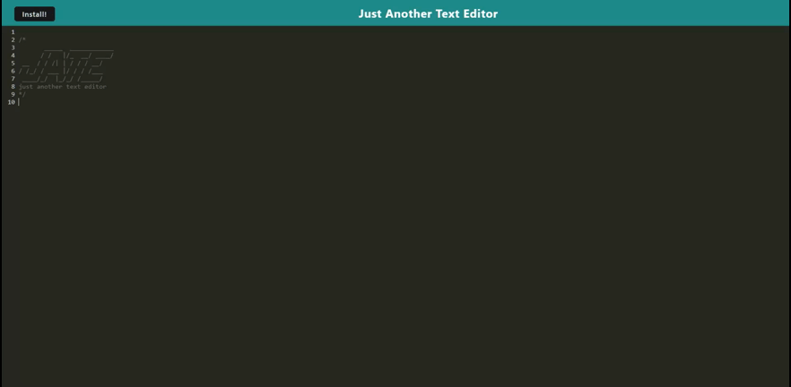

# Text Editor

## Table Of Contents
- [Description](#description)
- [Usage](#usage)
- [Dependencies](#dependencies)
- [Credits](#credits)

## Description
This is a simple text editor application that you can use to write some JavaScript code, or to just take notes. It can be used in browser, or as an installable app. It will save what was written in it even if you switch between the in browser text editor and the installable application. 

## Usage

  

## Dependencies
- node.js
- npm
- express.js
- webpack
- babel 
- workbox

## Credits
Starter code from [Coding Boot Camp](https://github.com/coding-boot-camp/cautious-meme)

## Deployed Site
[Just Another Text Editor](https://zs-just-another-text-editor-6b87175c8637.herokuapp.com/)
